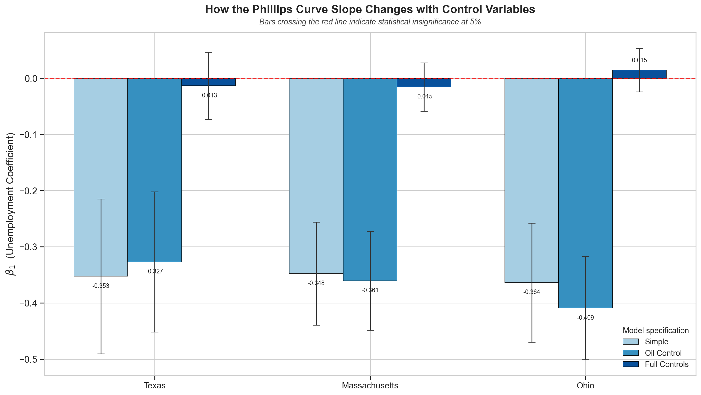
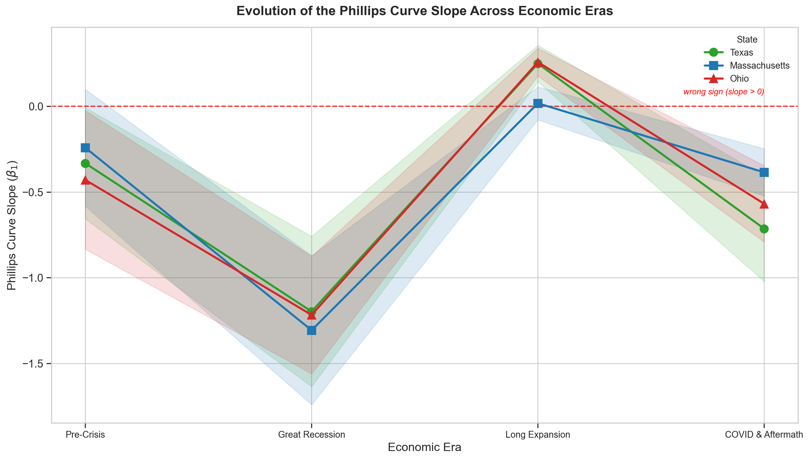

# Does the Phillips Curve Still Hold at the State Level?

An independent undergraduate research project examining the relationship between inflation and unemployment in Texas, Massachusetts, and Ohio from 2000 to present.

---

## Summary

The Phillips Curve says unemployment and inflation move in opposite directions. When the labor market is tight, employers compete for workers, wages rise, and firms pass those costs into prices. Almost every study of this relationship uses national data. I ran it on three individual states instead — Texas, Massachusetts, and Ohio — because their economies work in completely different ways. The question I wanted to answer: does the unemployment-inflation tradeoff actually operate through local labor markets, or does something that looks like a Phillips Curve really just reflect national inflation, oil prices, and housing costs showing up in every state at once?

I built a monthly panel dataset from FRED and BLS series covering January 2001 through July 2026 — 306 months for each state, 918 observations total. I loaded it into a SQLite database with five normalized tables, then estimated the Phillips Curve with progressively more demanding methods: simple OLS for each state, multiple regression with control variables, panel regressions with fixed effects, and a sub-period analysis testing whether the relationship changed over time.

The simple regression looks exactly like the textbook. All three states show a negative slope around -0.35, significant well past the 1% level. Then I added controls for national inflation, oil prices, mortgage rates, and the federal funds rate, and the slope collapsed to roughly -0.01 in every state — statistically indistinguishable from zero. Most of what looked like a local labor market effect was national and global forces. National inflation alone does almost all the work: state prices move roughly one-for-one with the national trend.

The relationship is also not stable. Estimated era by era, the slope was moderately negative before 2008, steeply negative during the Great Recession, actually **positive** during the 2010s expansion, and negative again after 2020. One number cannot describe this relationship, which is a large part of why economists still argue about it.

**What this project demonstrates:**

- Working with real economic data from government sources (FRED, BLS, FHFA) and handling messy data problems — mixed-frequency series, gaps in bimonthly metro CPI releases, and constructing state-level inflation by splicing metro and regional CPI
- SQL database design — a normalized five-table schema, multi-table JOINs on composite keys, `GROUP BY` aggregation, `CASE` bucketing, and a `LAG(...) OVER (...)` window function for year-over-year oil price changes
- Econometric analysis in Python — OLS, multiple regression, panel data with one-way and two-way fixed effects, interaction models, and diagnostic testing using `statsmodels` and `linearmodels`
- Communicating quantitative findings clearly — interpreting coefficients, showing omitted variable bias in action, and reporting a null result honestly instead of burying it

| Notebook | What it does |
|---|---|
| `01_data_collection.ipynb` | Pulls every series from the FRED API, builds the SQLite database, runs the portfolio SQL queries, exports the analysis-ready panel |
| `02_exploratory_analysis.ipynb` | Visualizes the data — time series plots, Phillips Curve scatter plots by state and era, correlation matrices, and a deep dive on Texas oil |
| `03_regression_analysis.ipynb` | Runs every regression, compares specifications, tests era differences, and checks diagnostics and robustness |

---

## Why This Question Matters

A. W. Phillips documented the inverse relationship between unemployment and wage growth in 1958, using British data going back to 1861. Paul Samuelson and Robert Solow adapted it to U.S. price inflation shortly after, and for most of the 1960s policymakers treated it as a menu: accept slightly more inflation, get lower unemployment. Milton Friedman and Edmund Phelps then argued the tradeoff was only temporary, because workers eventually adjust their expectations and the curve shifts. The stagflation of the 1970s — high unemployment and high inflation together — seemed to prove them right.

The modern debate is about whether the relationship still exists at all. After the 2008 crisis, unemployment stayed near 10% for years without the disinflation-then-reflation pattern the curve implies. During the 2010s, unemployment fell to 3.5%, the lowest since 1969, and inflation barely moved off 2%. A lot of economists concluded the curve had gone flat, or died. Then COVID hit, inflation reached 9.1% in June 2022, and the argument restarted — with one camp saying the curve was never dead, just dormant while inflation expectations stayed anchored.

State-level data adds something the national debate cannot get at. The United States is not one economy. Texas runs on oil, Massachusetts on healthcare and tech, Ohio on manufacturing. If the Phillips Curve depends on economic structure, three states with different structures should produce three different slopes. Splitting by state also separates local labor market effects from national trends, because a shock that hits every state in the same month can be absorbed by time fixed effects rather than misattributed to the local unemployment rate.

---

## Why Texas, Massachusetts, and Ohio

I picked these three states because they are structurally different in ways that map onto competing explanations for the Phillips Curve. Each one predicts a different result, so comparing them is a real test rather than a replication.

| | Texas | Massachusetts | Ohio |
|---|---|---|---|
| Main industries | Oil & gas, technology, healthcare, trade | Healthcare, higher education, technology, finance | Manufacturing, healthcare, agriculture, logistics |
| Energy share of GDP | 12.0% | 0.3% | 1.8% |
| Manufacturing share of GDP | 8.5% | 9.0% | 16.5% |
| Union membership rate | 4.7% | 12.5% | 11.8% |
| Median household income | $67,500 | $89,645 | $59,750 |
| Adults with a bachelor's degree | 32% | 45% | 29% |

**Texas** is the most interesting case. Oil and gas is about 12% of state GDP. When crude prices spike, the energy sector hires — drilling, services, midstream — so unemployment falls. At the same time, fuel and freight costs push consumer prices up, so inflation rises. Both happen for the same reason, and neither runs through labor market tightness. The result is a pattern that mimics the Phillips Curve without being caused by it. That is the confounding problem that motivates putting oil prices in the regression.

**Massachusetts** should show the clearest Phillips Curve. Union membership is 12.5%, close to triple the Texas rate, which gives workers more leverage to demand raises when hiring is tight. The economy is service-heavy — healthcare, education, finance — and services prices track local wages more directly than manufactured goods or extracted commodities do. High living costs and a constrained housing market should amplify the wage-to-price link.

**Ohio** is the manufacturing case. At 16.5% of GDP, a large share of what Ohio produces competes in global markets. A firm selling into a world market cannot raise prices when local wages rise without losing sales to foreign competitors, so local labor pressure should show up weakly in prices. Ohio also lost manufacturing jobs steadily across this period, which changed the composition of its labor force in ways a monthly unemployment rate does not capture.

These characteristics inform how I read the results, but none of them enter the regressions. They barely move over 25 years, so in a monthly model they would be nearly constant — and any permanent state-level difference is already absorbed by the state fixed effects.

---

## The Data

Everything comes from FRED, the BLS, the FHFA, and the Census Bureau, pulled through the FRED API. The API key lives in a local file that is gitignored.

**Unemployment.** Monthly, seasonally adjusted state unemployment rates from the BLS Local Area Unemployment Statistics program. Series: `TXUR`, `MAUR`, `OHUR`.

**Inflation.** This required construction, because the BLS does not publish a CPI for individual states. I start with the CPI for the largest metro area in each state — Houston, Boston, and Cleveland-Akron — then fill gaps with the Census region CPI (South, Northeast, Midwest), then compute the year-over-year percentage change. The gaps are real: several metro CPI series are published bimonthly rather than monthly. This is a proxy. Houston is not Texas, and metro CPI weights differ from statewide consumption patterns, so some measurement noise is baked into the dependent variable. I list it under limitations for that reason.

**National controls.** Four series, each included for a specific reason:

| Variable | Why it is in the model |
|---|---|
| National CPI inflation (YoY) | Captures economy-wide price trends that hit all states at once |
| WTI crude oil price | The confounder for Texas, and an input cost everywhere |
| 30-year fixed mortgage rate | Housing is the largest single component of CPI |
| Federal funds rate | Monetary policy, which drives both inflation and unemployment |

**State housing.** The FHFA House Price Index for each state. It is quarterly, so I forward-fill it to a monthly grid; it sits in the database and the panel but stays out of the final regressions.

The year-over-year calculation costs the first twelve months of data, so the regression sample runs January 2001 to July 2026: 306 months per state, 918 observations.

---

## How the Project Is Organized

The pipeline is linear:

```
FRED API → pandas DataFrames → SQLite database (5 tables) → SQL joins → analysis panel CSV → figures → regression models
```

**Database tables** (`data/phillips_curve.db`):

| Table | One row is | Primary key |
|---|---|---|
| `state_unemployment` | One state in one month | `(date, state)` |
| `state_inflation` | One state's CPI level and YoY rate in one month | `(date, state)` |
| `national_controls` | All four national series for one month | `date` |
| `state_hpi` | One state's house price index in one quarter | `(date, state)` |
| `state_characteristics` | One state's structural profile (time-invariant) | `state` |

**SQL scripts** (`SQL/`), each runnable standalone against the database:

| File | What it demonstrates |
|---|---|
| `create_tables.sql` | Schema definition, composite primary keys, typed columns |
| `build_analysis_panel.sql` | Three-table JOIN — two on `(date, state)`, one on `date` alone |
| `average_conditions_by_state.sql` | `INNER JOIN` on a composite key, `GROUP BY`, `COUNT`/`AVG`/`MIN`/`MAX` |
| `high_inflation_months.sql` | Filtering with `WHERE` and `HAVING`, sorting to surface extremes |
| `texas_oil_relationship.sql` | `LAG(...) OVER (ORDER BY date)` window function for YoY oil changes |
| `phillips_curve_by_era.sql` | `CASE` bucketing on dates, two-dimensional `GROUP BY`, custom `ORDER BY` |

---

## The Models

Each step adds one layer of rigor, and the interesting part is watching what happens to the unemployment coefficient as they stack up.

### Step 1 — Simple OLS, one regression per state

```
Inflation = β₀ + β₁ × Unemployment + ε
```

Nothing else in the model. This asks whether there is a raw negative correlation between unemployment and inflation. It is the starting point, not the answer.

### Step 2 — Add oil prices

```
Inflation = β₀ + β₁ × Unemployment + β₂ × Oil + ε
```

Same regression, one control added. This is a direct test of whether the Texas result comes from the energy sector rather than the labor market. If β₁ moves when oil enters the model, the original estimate was picking up oil's effect — that is omitted variable bias, and the size of the shift measures it.

### Step 3 — Full controls

```
Inflation = β₀ + β₁ × Unemployment + β₂ × Oil + β₃ × National inflation
            + β₄ × Mortgage rate + β₅ × Fed funds rate + ε
```

This asks the real question: once the major national and global forces acting on prices are accounted for, is there still a local labor market effect?

### Step 4 — Panel models

Instead of three separate regressions, stack all three states into one dataset and use its structure.

- **Pooled OLS** ignores the panel structure and treats all 918 observations as interchangeable.
- **State fixed effects** give each state its own intercept, which absorbs permanent differences between states — cost of living, housing markets, industry mix. The regression then uses only within-state variation, asking: when Texas unemployment rises above Texas's own average, does Texas inflation fall below Texas's own average?
- **Two-way fixed effects** add an intercept for every month, which absorbs any shock common to all three states — a Fed move, a national inflation wave, a global oil spike. What is left is purely cross-sectional within a month: in this month, does the state with relatively higher unemployment have relatively lower inflation?

In the two-way model the national controls drop out automatically. They do not vary across states, so the time dummies already contain everything they measured. All panel models use standard errors clustered by state, which allows observations within a state to be correlated with each other across months.

### Step 5 — Era analysis

Split the sample into four periods — Pre-Crisis (2000-07), Great Recession (2008-09), Long Expansion (2010-19), COVID and Aftermath (2020-present) — and estimate the slope inside each one. Then run an interaction model that formally tests whether those slopes differ from each other, rather than eyeballing four separate numbers.

### Step 6 — Diagnostics and robustness

Residual plots, the Durbin-Watson test, and Newey-West standard errors. Monthly economic data almost always has autocorrelation: an unexpectedly high inflation month is usually followed by another one, because whatever caused the surprise persists. Autocorrelation leaves the coefficients alone but shrinks the standard errors, which inflates t-statistics and makes p-values look better than they are. Newey-West standard errors correct for it.

---

## Key Findings

### The simple regression looks like a textbook Phillips Curve

| State | β₁ (unemployment) | p-value | R² |
|---|---|---|---|
| Texas | **-0.353** | 9.1e-07 | 0.076 |
| Massachusetts | **-0.348** | 1.1e-12 | 0.154 |
| Ohio | **-0.364** | 8.0e-11 | 0.130 |

Negative and significant in all three states, and the slopes are nearly identical. A one-point rise in unemployment comes with about a third of a point less inflation. But R² is 0.08 to 0.15, meaning unemployment explains at most 15% of the variation in state inflation. That is the first hint that the important forces are somewhere else.

### Oil prices distort the Texas result — and matter more broadly than I expected

| State | β₁ without oil | β₁ with oil | Oil coefficient | R² |
|---|---|---|---|---|
| Texas | -0.353 | **-0.327** | 0.0330 | 0.076 → 0.247 |
| Massachusetts | -0.348 | **-0.361** | 0.0177 | 0.154 → 0.222 |
| Ohio | -0.364 | **-0.409** | 0.0377 | 0.130 → 0.351 |

Texas is the only state whose slope moves **toward** zero when oil enters the model, which is the predicted attenuation: part of its apparent tradeoff was the energy sector hiring and fuel prices rising together. But the shift is modest, about 7%, and Massachusetts and Ohio get *steeper*, not flatter. Ohio's slope moves the most of the three and its R² nearly triples, with the largest oil coefficient in the sample.

That last part was not what I expected, and it is worth stating plainly. Oil is not only a Texas story — for a manufacturing state it is an input cost that shows up in prices without the offsetting employment boost, so controlling for it sharpens rather than dilutes the labor market signal. The Texas prediction holds in direction, but oil turns out to matter for all three states in different ways.

### With full controls, the local labor market effect disappears



| State | Simple β₁ | With oil | Full controls | Full R² |
|---|---|---|---|---|
| Texas | -0.353\*\*\* | -0.327\*\*\* | **-0.014** (p = 0.66) | 0.899 |
| Massachusetts | -0.348\*\*\* | -0.361\*\*\* | **-0.015** (p = 0.48) | 0.882 |
| Ohio | -0.364\*\*\* | -0.409\*\*\* | **+0.015** (p = 0.46) | 0.938 |

Once national inflation, oil, mortgage rates, and the fed funds rate are all in the model, the unemployment coefficient collapses by about 96% and loses significance everywhere. Ohio's even flips sign. Meanwhile R² jumps to roughly 0.9, so the controls explain nearly all the variation the simple model was missing.

The reason is national inflation, and specifically national inflation alone. Its coefficient in the Texas model is **1.06** with a t-statistic of 43 — state inflation moves essentially one-for-one with the national rate. I checked whether the controls were collectively responsible for the collapse or whether one of them was doing all the work: dropping only national inflation and keeping oil, mortgage rates, and the fed funds rate in the model returns the slope to **-0.327 (TX), -0.297 (MA), and -0.416 (OH)**, all significant. Every other control barely moves it.

That is worth being careful about, because state and national inflation are correlated at **0.94, 0.92, and 0.97** — they are close to being the same variable. Part of that overlap is economic: states share a currency, a central bank, and national supply chains. But part of it is **mechanical, from how I built the data**. The state series is metro CPI with Census-region CPI filling the months the metro series does not publish, and since the metro series are bimonthly, roughly half the observations for Texas and Massachusetts are region-level. Regional CPI is a component of national CPI, so I am partly regressing a series on something that contains it. The full-model coefficient is best read as a **lower bound** on the local relationship, not a clean estimate of it — which is the strongest argument for the panel design below, where time fixed effects absorb national conditions without putting a near-copy of the outcome on the right-hand side.

### The most rigorous model finds a small surviving relationship

| Panel model | β₁ | Std error | p-value | Fixed effects |
|---|---|---|---|---|
| Pooled OLS | -0.026 | 0.015 | 0.077 | None |
| State fixed effects | -0.011 | 0.010 | 0.291 | State |
| Two-way fixed effects | **-0.084** | 0.022 | **0.0002** | State + time |

The first two specifications find nothing. The two-way fixed effects model — the most demanding one, which strips out both permanent state differences and every shock common to all states in a month — finds a negative coefficient about a quarter the size of the simple estimate.

**That p-value depends on the standard error method, and I could not confirm it under the conventional one.** The coefficient is identical no matter which covariance estimator I use; only the standard error changes. Clustered by state it is 0.022 (p = 0.0002). Heteroskedasticity-robust it is 0.053 (p = 0.12). Classical it is 0.049 (p = 0.08). So the result is significant under clustering and insignificant under both alternatives — and clustering is the choice I can least defend here, because cluster-robust standard errors need roughly 30 to 50 clusters to be reliable and **this panel has three states**. With too few clusters the estimator produces standard errors that are too small, which is exactly what the 0.022 looks like.

So the honest reading is about the point estimate, not the p-value. The naive Phillips Curve is fragile; it evaporates the moment you control for anything. Sweeping out state baselines and common time shocks leaves a **stable negative estimate of -0.084** — roughly a quarter of the textbook slope, negative under every method — that I cannot confidently distinguish from zero with three states. The difference between -0.35 and -0.084 is the size of the confounding problem. Establishing significance would take more clusters, which means more states.

### The relationship is not stable over time



Bivariate slope, estimated separately in each era:

| Era | Texas | Massachusetts | Ohio | Months per state |
|---|---|---|---|---|
| Pre-Crisis (2000-07) | -0.333 | -0.242 | -0.430 | 84 |
| Great Recession (2008-09) | **-1.198** | **-1.307** | **-1.218** | 24 |
| Long Expansion (2010-19) | **+0.249** | +0.018 | **+0.258** | 120 |
| COVID & Aftermath (2020-) | -0.715 | -0.386 | -0.569 | 78 |

Moderately negative before 2008. Steeply negative during the Great Recession, when a textbook demand collapse pushed unemployment up and inflation down at the same time — the slope is more than three times the full-sample estimate. Flat to positive during the 2010s, the "missing inflation" decade, and the positive Texas and Ohio slopes are statistically significant, meaning the relationship did not just weaken but inverted. Negative again after 2020.

The interaction model confirms these are real differences, not noise: with controls included and Pre-Crisis as the baseline slope of -0.269, all three era interaction terms are significant (p = 0.009, p < 0.0001, p < 0.0001). One caveat on the same model — net of controls, the implied COVID-era slope is close to zero (-0.016), so the strong negative COVID slope in the table above is mostly national inflation, not a revived local tradeoff.

### The diagnostics mostly hold up

Residuals from the full models are reasonably scattered with no obvious funnel shape, though the tails are fatter than normal in every state. Durbin-Watson comes out near 2 for Texas (1.97) and Massachusetts (1.91), which is clean, but 1.22 for Ohio — positive autocorrelation, so Ohio's standard errors were understated.

Re-estimating with Newey-West standard errors (12 monthly lags) moves the standard errors in the expected direction — Texas 0.031 → 0.042, Ohio 0.020 → 0.034 — and leaves every coefficient identical, since only the inference changes. All three p-values stay above 0.40. The null result on the full-model Phillips slope is not an artifact of understated standard errors. And the one significant finding, the two-way fixed effects slope, was already estimated with state-clustered standard errors, which handle the same problem.

---

## Limitations

- **Only three states.** Expanding to all 50 would give far more statistical power and much more structural variation to exploit.
- **State inflation is a constructed proxy, and about half of it is regional.** Metro CPI spliced with Census-region CPI is not a direct measurement of state prices. Because the metro series are bimonthly, roughly half the monthly observations for Texas and Massachusetts are region-level — Houston alternating with the whole South, Boston with the Northeast. That mutes genuine state-specific price variation and biases estimated slopes toward zero, so the null results are partly a measurement artifact. (Related: the `cpi_index` column in the exported panel is a spliced level series that jumps between two index bases, so it should not be differenced to build your own inflation rate. Notebook 01 computes year-over-year rates on each source series separately and splices the rates, which is why `inflation_rate_yoy` is unaffected.)
- **National inflation overlaps the dependent variable.** State and national inflation correlate at 0.92 to 0.97, and part of that is mechanical — the state series is built partly from regional CPI, which feeds the national index. Controlling for national inflation therefore removes more than just "national conditions," and the full model's near-zero unemployment coefficient is a lower bound on the local relationship rather than a clean measure of it.
- **Three clusters is too few for cluster-robust inference.** The two-way fixed effects result is significant with standard errors clustered by state but not with heteroskedasticity-robust ones, and the method needs roughly 30 to 50 clusters to be trusted. With three states I can defend the point estimate and its direction, not its statistical significance.
- **Correlation, not causation.** Unemployment and inflation are both driven by the business cycle. Pinning down a causal direction would need something like instrumental variables, which is beyond this project's scope.
- **No inflation expectations.** Modern Phillips Curve theory treats expected inflation as a central variable. State-level expectations data does not exist, so the model omits something the theory says matters.
- **Linear and same-month only.** The real relationship may be nonlinear — steeper at very low unemployment — and it may operate with a lag, since wage bargains and price resets take months to work through. My specification allows for neither.
- **The Great Recession estimates rest on 24 months per state.** Those slopes near -1.2 are the largest in the project and the least reliable. Treat them as suggestive.
- **The sample runs to July 2026 and includes a small amount of recently revised data**, so the most recent months may shift as BLS and FRED series are finalized.

The natural next step is expanding to all 50 states. That fixes the sample size problem and gives enough cross-state variation for the two-way fixed effects design — the one specification that found anything — to be estimated far more precisely.

---

## Repository Structure

```
phillips-curve-states/
├── notebooks/
│   ├── 01_data_collection.ipynb
│   ├── 02_exploratory_analysis.ipynb
│   └── 03_regression_analysis.ipynb
├── SQL/
│   ├── create_tables.sql
│   ├── build_analysis_panel.sql
│   ├── average_conditions_by_state.sql
│   ├── high_inflation_months.sql
│   ├── texas_oil_relationship.sql
│   └── phillips_curve_by_era.sql
├── data/processed/
│   ├── phillips_curve_panel.csv
│   ├── state_characteristics.csv
│   ├── master_regression_results.csv
│   └── panel_regression_results.csv
├── figures/
├── notes/
│   └── analysis-audit.md
├── scripts/
│   └── audit_project.py
└── README.md
```

`notes/analysis-audit.md` is a self-review of the analysis: I re-ran every major
claim against the data and documented where the results are strong, where they are
fragile, and where the interpretation needed a caveat. The two issues worth reading
about before quoting any number from this project are the three-cluster standard
error problem and the overlap between state and national inflation.
`scripts/audit_project.py` is the data and repository quality check (72 checks, exits
non-zero on failure).

The SQLite database and the raw FRED downloads are gitignored. They are large and fully reproducible by running notebook 01.

---

## Running It Yourself

1. Get a free API key from [fred.stlouisfed.org](https://fred.stlouisfed.org/docs/api/api_key.html) and save it as `fred_api_key.txt` in the project root.
2. Install dependencies:
   ```
   pip install pandas numpy matplotlib seaborn statsmodels linearmodels fredapi certifi
   ```
3. Run the notebooks in order from the `notebooks/` folder.

Only notebook 01 needs the API key. Notebooks 02 and 03 read from the processed CSVs, so if those files are already in `data/processed/` you can reproduce the entire analysis without touching FRED.

---

## Built With

Python, pandas, NumPy, Matplotlib, Seaborn, SQLite, statsmodels, linearmodels, and the FRED API.
